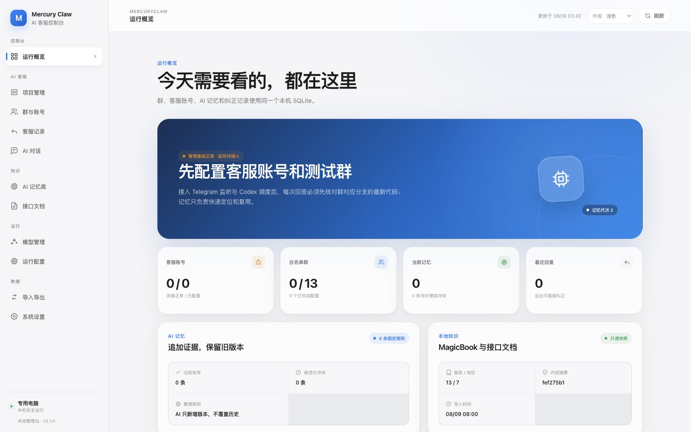
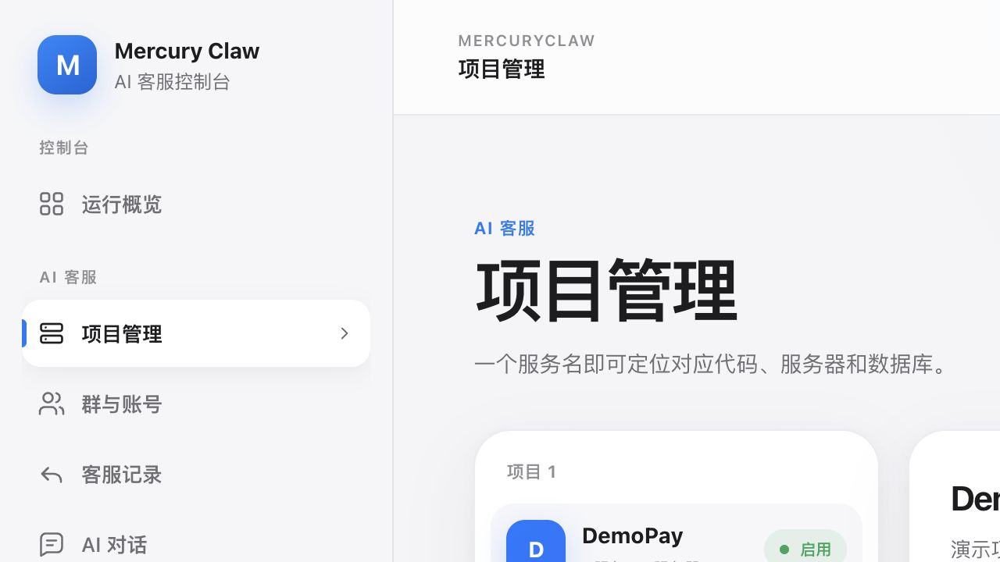
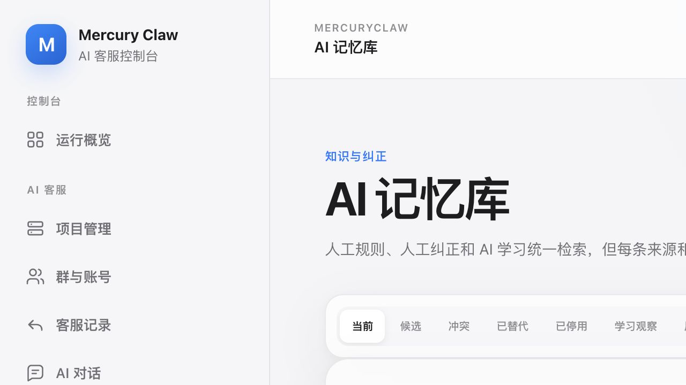
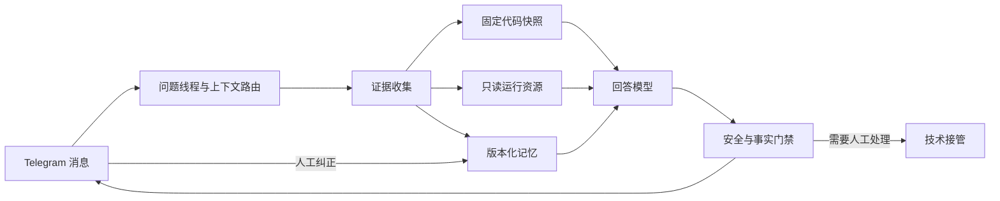

# Mercury Claw · Telegram Codex AI 客服

一个面向 Telegram 技术支持群的本地 AI 客服系统。它把群聊上下文、项目代码、只读运行证据、人工纠正和版本化记忆放进同一条处理链路，让客服回复不只“像人”，还能够说明事实来自哪里。



## 它解决什么问题

普通聊天机器人擅长组织语言，但技术客服真正困难的是上下文与证据：同一句“这笔为什么还在处理中”，可能需要同时核对订单状态、回调日志、当前发布代码和上游返回。

Mercury Claw 将一次客服处理拆成可追踪的问题线程：

- 自动承接同一问题的补充消息、引用回复和附件。
- 按群绑定项目与服务，不因聊天中出现其他服务名而越权读取。
- 在固定代码快照和临时只读资源工作区内完成排查。
- 区分聊天转述、截图、接口响应、回调、服务器日志、数据库和模型推断。
- 保存人工纠正与原始证据，派生出带版本、作用域和置信度的 AI 记忆。
- AI 处理失败或确需内部修改时，按真实投递状态交给技术人员接管。

## 核心能力

### 有状态的客服对话

消息按问题线程而不是单条消息处理。系统支持滑动等待窗口、明确引用关系、最少追问续接、输入版本替换、生成任务取消以及 30 分钟自动归档。新证据到达时，旧答案不会覆盖最新版本。

### 基于证据的只读排查

每个服务绑定后端仓库、前端仓库、发布分支、服务器和数据库资源。回答任务在临时工作区中读取固定提交，并只允许受控的日志、数据库、Redis 和系统状态查询；业务写操作不会暴露给回答模型。

### 三层 AI 记忆

SQLite 内部将知识拆成不可变固定规则、追加式原始证据和版本化 AI 记忆。人工纠正不会覆盖历史，冲突证据会同时保留，低风险结论也只有在多条独立证据一致时才会自动生效。

### 人工协作与审计

可以配置运营、技术、审核员和忽略用户。角色用户的普通消息只留审计，不会变成新的客服问题；人工接管、纠正、技术告警、Telegram 发送状态和失败恢复都有持久记录。

### 多模型接入

支持 Codex CLI，以及 OpenAI、Claude、DeepSeek、GLM 等兼容的 API 模型配置。回答模型和记忆模型独立选择，运行参数在任务开始时形成快照，不会因后台临时修改而改变正在执行的任务。

## 界面预览

所有截图均使用全新的演示数据库和虚构项目生成，不包含真实群、订单、服务器或账号信息。

### 项目与服务



### 版本化记忆



## 处理链路



## 快速开始

要求：

- Node.js 22.16 或更高版本
- pnpm 10
- 一个可用的 Telegram Bot，或已登录的 Telegram 个人账号
- Codex CLI 登录状态，或受支持模型厂商的 API 密钥

```bash
git clone https://github.com/Aruke05/telegram-codex-support.git
cd telegram-codex-support
cp .env.example .env
pnpm install
pnpm typecheck
pnpm test
pnpm build
pnpm start
```

打开 [http://127.0.0.1:3210](http://127.0.0.1:3210)。管理台默认只监听本机回环地址，不加载外部字体、CDN、图标或统计脚本。

首次使用建议按下面的顺序配置：

1. 在“模型管理”添加回答模型与记忆模型。
2. 在“项目管理”添加项目、前后端仓库、服务和只读资源。
3. 在“群与账号”登录客服账号并绑定白名单群。
4. 在“运行配置”选择模型并完成自检。

### 学习模式上线前演练

“群与账号”可为单个客服群或批量选择的客服群开启“学习模式”。新问题仍会按群级语境拆成独立问题、读取当前已发布代码并完成只读排查，但不会发送客服回复、进度提示或技术告警。已启用且标记为“学习来源”的角色回复会作为真人参考；同一条真人回复可关联同批拆分出的多个问题，报告模型再逐问题判断是否相关并比较准确性、可靠性和群聊口吻。

首份报告固定在北京时间 `2026-08-20 23:00` 生成，可在“AI 记忆库 → 学习报告”查看或手动另建报告。报告只供人工审核，不会自动写入规则、AI 记忆或真人口吻。审核完成后需人工批量切回“正式回复”，且只影响之后创建的新问题。

## 常用命令

```bash
pnpm typecheck       # TypeScript 类型检查
pnpm test            # 运行测试
pnpm build           # 构建服务端和管理台
pnpm start           # 启动构建后的服务
pnpm dev             # 开发模式
```

macOS 专用电脑可以安装当前用户的 LaunchAgent：

```bash
pnpm service:install
pnpm service:status
pnpm service:uninstall
```

Linux 部署可以使用仓库中的 Dockerfile，或由 systemd 直接托管 `node dist/server.js`。生产环境建议继续只监听回环地址，并通过已有的安全入口访问管理台。

## 数据与安全

- 运行状态统一保存在本机 SQLite，不依赖外置业务数据库。
- Bot Token、Telegram Session 和模型 API 密钥使用本机主密钥加密保存。
- `data/`、`.env`、Session、运行日志、附件和 SQLite 文件均已排除在 Git 之外。
- 回答任务只获得当前群绑定服务的临时凭据，结束后立即清理临时工作区。
- 附件实体文件默认只保留 3 天；聊天记录和附件元数据按保留策略清理。
- 迁移数据库可能包含服务器和数据库连接资料，应始终按敏感文件保管，不能提交到代码仓库。

当前公开版本不提供任何真实 Telegram 凭据、生产服务器地址、数据库账号或运行数据库。示例配置中的群 ID 均为空，默认全部停用。

## 目录结构

```text
src/                 服务端、Telegram 接入、路由、排查与记忆
web/                 原生 TypeScript 管理台
config/              脱敏且默认停用的引导配置
knowledge/bootstrap/ 脱敏接口文档与 MagicBook 快照
docs/                设计文档、排查规则与项目截图
tests/               路由、记忆、安全和恢复测试
```

更完整的运行约束见 [AGENTS.md](AGENTS.md)，专题设计记录位于 [docs/superpowers](docs/superpowers)。

## 项目状态

项目仍在持续迭代，当前重点是客服线程路由、只读排查可靠性、人工接管体验和记忆质量。公开源码目前未附带开源许可证；如需复用、分发或商业使用，请先联系仓库所有者。
